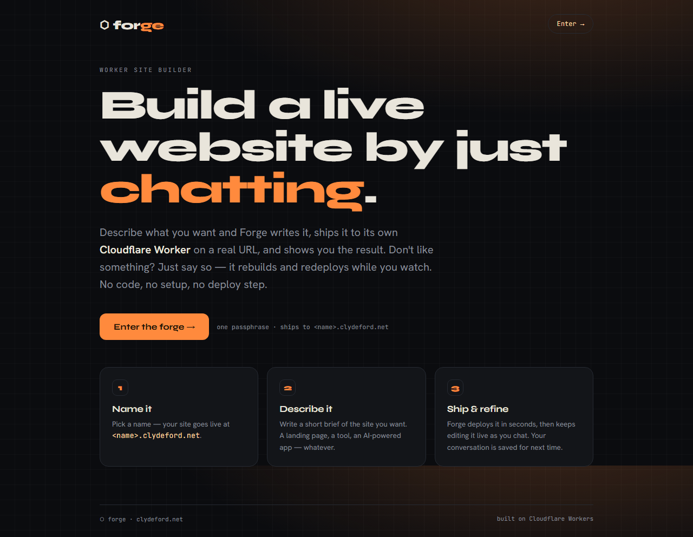
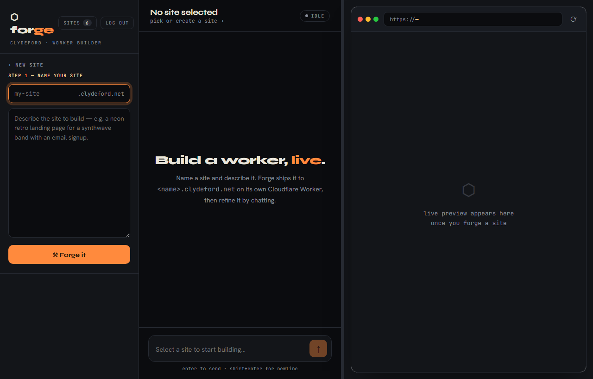
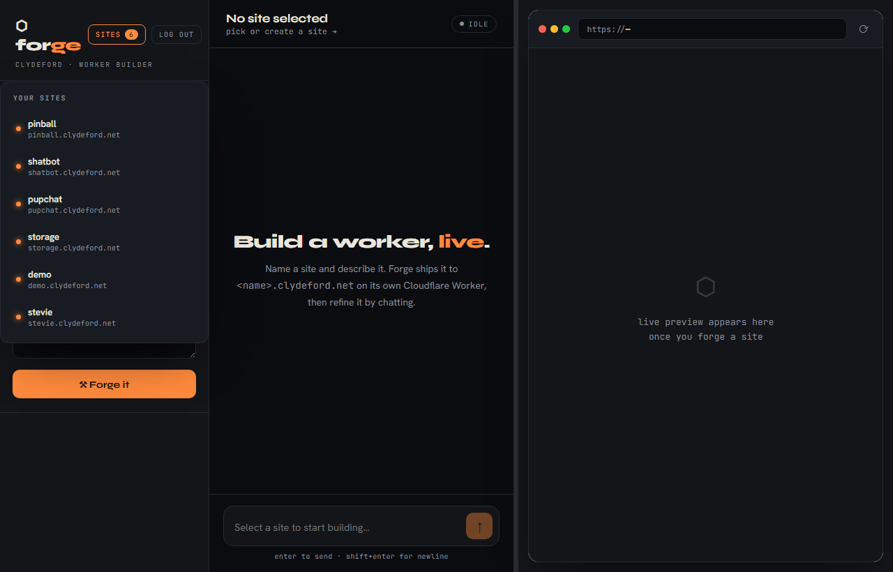
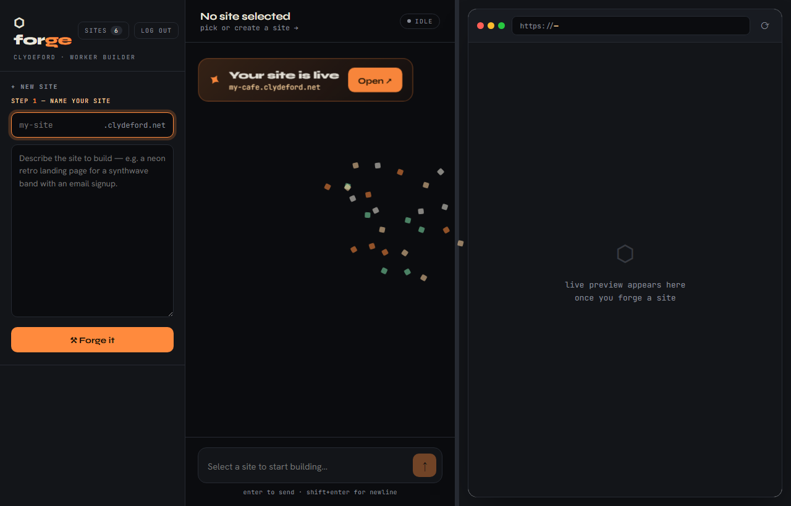
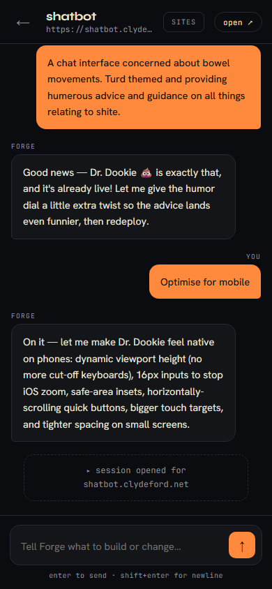
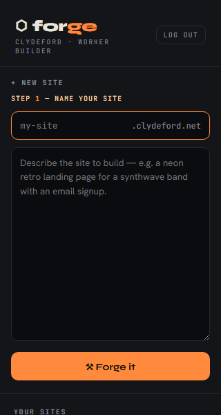

# ⬡ forge — build a live website by just chatting

**forge** is a Cloudflare Worker that hosts an AI coding assistant (Claude Opus 4.8).
You describe a website in plain English; forge generates a **single-file Cloudflare
Worker**, deploys it live to its own `<name>.clydeford.net` subdomain, and lets you
refine it conversationally — each edit redeploys in seconds.



## How it works

1. **Name it** — pick a name; the site goes live at `<name>.clydeford.net`.
2. **Describe it** — write a short brief (a landing page, a tool, an AI-powered app…).
3. **Ship & refine** — Claude writes the Worker, calls its `deploy_worker` tool, and the
   host Worker ships it to the Cloudflare API. Keep chatting to change it; the whole
   conversation and the current script are saved per-site, so you can pick up later and
   the assistant still has full context.

## Features

- **Conversational builds** — Claude Opus 4.8 streams its reasoning and deploys via a tool call.
- **Live preview** — a built-in browser pane shows each deploy, with a draggable divider to
  resize chat vs. preview (position persists across reloads; double-click to reset).
- **Per-site memory** — each site is a `SiteSession` Durable Object holding its full chat
  history + current script. Reopen a site any time and the transcript replays.
- **Guided onboarding** — the name and brief fields pulse as step 1 → step 2 to walk you
  through creating your first site.
- **Build flair** — a verb spinner ("Forging… Compiling… Shipping…") while building, then a
  celebratory announcement card with a confetti burst and an **Open ↗** button.
- **Mobile layout** — a two-view (sites ⇄ chat) layout with a sites switcher in the header;
  builds survive backgrounding the browser (the deploy completes server-side and the UI
  resyncs on return).
- **Public landing page** + single-passphrase auth (HMAC-signed cookie), with logout.

## Screenshots

| Builder | Sites switcher |
|---|---|
|  |  |

| Build announcement | Mobile chat | Onboarding |
|---|---|---|
|  |  |  |

## Architecture

```
Browser ──► forge Worker (builder.clydeford.net)
              ├─ Public landing + password auth (HMAC cookie)   src/auth.ts
              ├─ Router + sites API + /logout                   src/index.ts
              ├─ Chat UI (sidebar + chat + live preview)        src/ui.ts
              ├─ SiteSession Durable Object (history + script)  src/session.ts
              ├─ Anthropic client (Claude + deploy_worker tool) src/anthropic.ts
              └─ Deploy client (Cloudflare API) ──► <name>.clydeford.net   src/deploy.ts

SITES KV namespace  ── index of created sites (name, url, timestamps)
```

Generated sites are single-file module Workers, each on its own custom domain. Their
`ANTHROPIC_API_KEY` is injected as a secret binding so they can build AI-powered features
too; no KV/D1 bindings are provisioned for them by design.

## Prerequisites

- **Node 18+** and npm.
- A **Cloudflare account** with a zone you control (this deployment uses `clydeford.net`;
  set yours in `wrangler.toml` → `SITE_ZONE`, `CF_ACCOUNT_ID`, `ZONE_ID`).
- A **Cloudflare API token** with *Workers Scripts: Edit*, *Workers Routes / Custom Domains:
  Edit*, and *Zone: Read* on your zone.
- An **Anthropic API key**.

## Local development

```bash
npm install
cp .dev.vars.example .dev.vars     # then fill in real values (gitignored)
cp .env.example .env               # wrangler CLI auth for deploys (gitignored)
```

`.dev.vars` holds the Worker's runtime secrets:

```
CF_API_TOKEN=<Cloudflare API token>     # used by the Worker to deploy child sites
ANTHROPIC_API_KEY=<Anthropic key>
APP_PASSWORD=<choose a login password>
SESSION_SECRET=<long random string>
```

Create the KV namespace and paste the returned id into `wrangler.toml`
(`[[kv_namespaces]] id = "..."`):

```bash
npx wrangler kv namespace create SITES
```

Run it:

```bash
npm run dev        # http://localhost:8787 — log in, create a site, send a build request
```

> Local dev still deploys **real** child Workers and calls Claude — costs apply.

## Tests & typecheck

```bash
npm test           # vitest (Anthropic + Cloudflare APIs are mocked)
npm run typecheck  # tsc --noEmit
```

> This project's path contains a space (`agent builder`), which is only compatible with
> `@cloudflare/vitest-pool-workers` 0.8.x + vitest 3.1.x (pinned in `package.json`).

## Deploy

```bash
# 1. Production secrets (one-time):
npx wrangler secret put CF_API_TOKEN
npx wrangler secret put ANTHROPIC_API_KEY
npx wrangler secret put APP_PASSWORD
npx wrangler secret put SESSION_SECRET

# 2. Ship the host Worker (binds builder.clydeford.net as a custom domain):
npx wrangler deploy
```

The first deploy of each `<name>.clydeford.net` provisions a TLS cert (~10–60s), so the live
preview may briefly show a "provisioning" state.

## Visual verification

UI changes are screenshot-verified with Playwright. The scripts under `scripts/shoot*.mjs`
log in and capture the landing page, builder, sites dropdown, build flair, and mobile views
into `shots/` (gitignored). Run e.g. `node scripts/shoot.mjs` after a UI change.

## Configuration reference

| Binding | Type | Where |
|---|---|---|
| `SITE_SESSION` | Durable Object | `wrangler.toml` (sqlite migration `v1`) |
| `SITES` | KV namespace | `wrangler.toml` |
| `CF_ACCOUNT_ID`, `ZONE_ID`, `SITE_ZONE` | vars | `wrangler.toml` |
| `CF_API_TOKEN`, `ANTHROPIC_API_KEY`, `APP_PASSWORD`, `SESSION_SECRET` | secrets | `wrangler secret put` / `.dev.vars` |

## Project structure

```
src/
  index.ts      router, auth gate, sites API, landing page, /logout
  ui.ts         login + landing + app HTML/CSS/JS (single-file UI)
  session.ts    SiteSession Durable Object (turn orchestration, persistence)
  anthropic.ts  Claude streaming turn + deploy_worker tool
  deploy.ts     Cloudflare API client (upload script, attach/remove domain)
  auth.ts       password check, HMAC session cookie
  names.ts      site-name sanitization / validation
  types.ts      shared types
tests/          vitest suites (mocked Anthropic + CF APIs)
scripts/        Playwright screenshot harness
docs/           design specs + README screenshots
```

## Roadmap / notes

- Per-site access control (Google MFA + email allow-list in front of forged sites) is
  **designed but parked** — see `docs/superpowers/specs/`.
</content>
